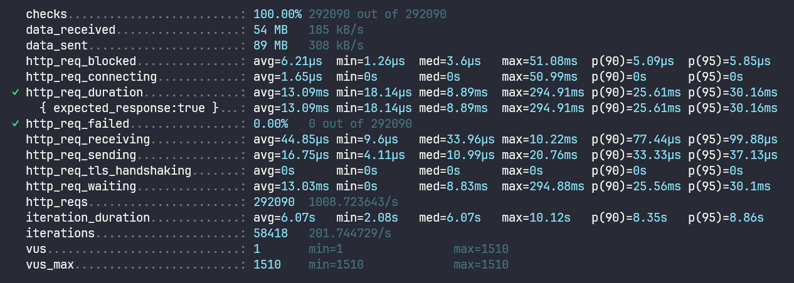

# Avito Shop
## Стек
- Go 1.24
- PostgreSQL
- Docker & Docker Compose
- Grafana k6
## Запуск проекта
```bash
# Клонирование проекта
git clone https://github.com/njslxve/avito-shop.git

# Запуск
docker compose up -d
```
## Тестирование
### Unit tests
```bash
go test ./internal/...
```
### E2E tests
Необходимо запустить тестовую базу данных.
Docker Compose файл тестовой бд доступен в ./tests
```bash
# Запускаем тестовую базу данных
cd tests
docker compose up -d
```
Далее запускаем сами тесты находясь в директории tests
```bash
go test ./e2e/...
```
### Нагрузочное тестирование
Нагрузочное тестирование было выполненно с помощью утилиты Grafana k6. \
Файл конфигурации нагрузочного тестирования доступен в ./k6-config/loadtest.js

Результаты тестирования

Тестирование показало что приложение выдерживает нагрузку в 1к RPS \
Так же соблюдены требования к SLI успешности ответа (99.99%) \
И соблюдены требования к SLI времени ответи (< 50ms)
